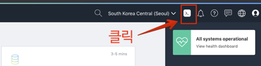
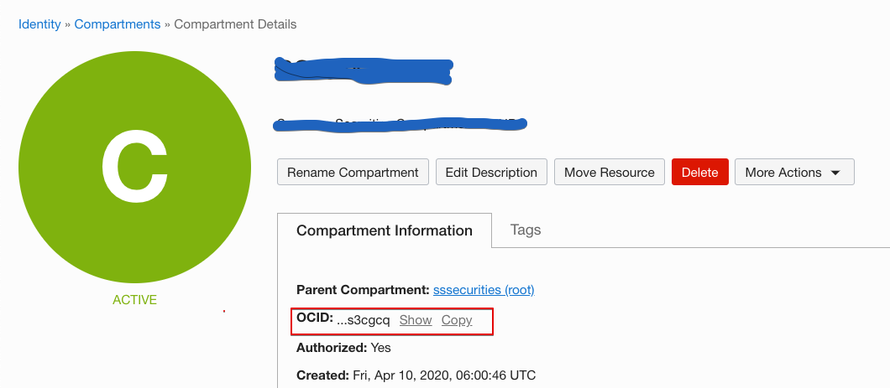
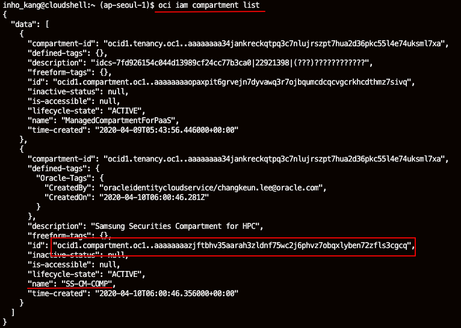
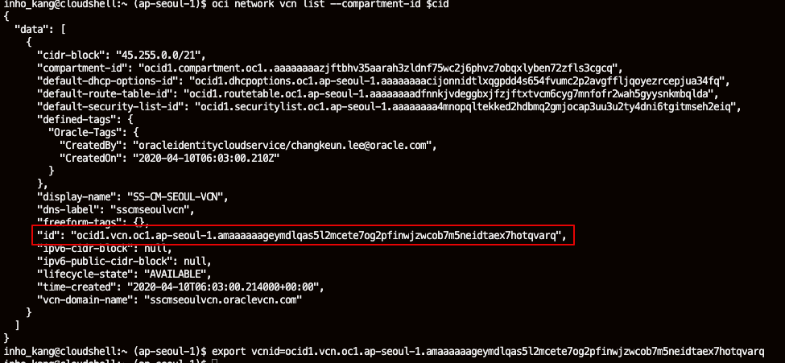

# OCI-CLI Hands On


<details>
<summary>
<b><font size=5>1. Cloud Shelld을 이용한 OCI CLI 실습</font></b>
</summary>

## Cloud Shell 사용



>OCI Shell은 Web기반의 터미널에 접속할 있는 Oracle Cloud Console 기능입니다.  
리눅스 기반이며, OCI CLI를 이용할 수 있도록 인증관련 설정이 되어 있으며, OCI를 이용하면 필요로 하는 다양한 Tool들이 최신버전으로 설치되어 있습니다. 

 - 최신 버전의 OCI CLI(Orcommand Line Interface)와 다수의 유용한 도구로 사전 구성된 Linux 셸의 호스트로 사용할 임시 시스템
 - 홈 디렉토리를 위한 5GB의 스토리지
 - 콘솔에서 다른 페이지로 이동하더라도 Cloud Shell이 있는 하단의 프레임 변경없이 활성 상태를 유지


### 사전 설치된 유용한 도구들
 - Git
 - Java
 - Python (2 and 3)
 - SQL Plus
 - kubectl
 - helm
 - maven
 - gradle
 - terraform


자세한 사항은 [여기](https://docs.cloud.oracle.com/en-us/iaas/Content/API/Concepts/cloudshellintro.htm)를 참조하세요


### OCI CLI 설치 
개인 노트북에 직접 설치해서 실습을 원하는 분은 아래 링크를 참조하십시오
 - [OCI CLI 설정 기본 정보 수집](http://taewan.kim/tutorial_manual/handson_adw/05.preprocessing/3/)
 - [OCI CLI 설치 및 기본 설정](http://taewan.kim/tutorial_manual/handson_adw/05.preprocessing/4/)

### Terraform 설치
Terraform 설치는 아래 URL을 참고합니다.
https://learn.hashicorp.com/terraform/getting-started/install.html


#### OCI 설치 확인
```shell
# Basic Step
# oci cli version 확인
$ oci -v

# oci object storage namespace 확인
$ oci os ns get
# instance principal의 경우는 
$ oci os ns get --auth instance_principal

# Advanced Step
# oci 설정 정보 확인
$ cat /etc/oci/config

# oci profile 확인
$ env | grep PROFILE
```

#### Terraform 설치 확인
```shell
# Terraform 설치확인
$ terraform version

```

</details>


<details>
<summary>
<b><font size=5>2. OCI CLI를 이용한 VCN 생성</font></b>
</summary>

### 생성된 Compartment와 VCN 조회하기  

#### 메뉴->Identity->Compartment에서 본인이 만든 Compartment OCID 확인



#### 혹은 아래와 같이 OCI CLI로 Compartment OCID를 확인한다. 

```bash
$ oci iam compartment list
```




#### VCN 생성을 쉽게 하기 위해서 변수를 선언한다. 

```shell
# compartment 변수 선언
$ export cid=<your compartment ocid>

# VCN 만들기

$ oci network vcn list --compartment-id $cid

```




### VCN 생성하고 Public Subnet 생성하기 
 - #### CIDR Block 192.168.0.0/16 VCN 생성
 
 ```shell
$ oci network vcn create --cidr-block 192.168.0.0/16 -c <your compartment OCID> --display-name CLI-Demo-VCN --dns-label clidemovcn
 
#여기서 만들어진 VCN 의 id를 이용해 아래 처럼 환경 변수를 추가한다. 

# vcnid 변수 선언
$ export vcnid=<your vcn ocid>

 ```

 > VCN 생성을 위한 자세한 사항은 [여기](https://docs.cloud.oracle.com/en-us/iaas/tools/oci-cli/2.9.10/oci_cli_docs/cmdref/network/vcn/create.html)를 참조하세요

 - #### Security List, Subnet, Internet Gateway 생성

 ```shell

 $ oci network security-list create --display-name PubSub1 --vcn-id $vcnid -c $cid --egress-security-rules '[{"destination": "0.0.0.0/0", "destination-type": "CIDR_BLOCK", "protocol": "all", "isStateless": false}]' --ingress-security-rules '[{"source": "0.0.0.0/0", "source-type": "CIDR_BLOCK", "protocol": 6, "isStateless": false, "tcp-options": {"destination-port-range": {"max": 80, "min": 80}}}]'

# security list 변수 선언
 $ export seclistid=<your security-list ocid>

# Subnet 생성
 $ oci network subnet create --cidr-block 192.168.10.0/24 -c $cid --vcn-id $vcnid --security-list-ids '["$seclistid"]'

# Internet Gateway 생성
 $ oci network internet-gateway create -c $cid --is-enabled true --vcn-id $vcnid --display-name DemoIGW
 
# rout table 조회
 $ oci network route-table list -c $cid --vcn-id $vcnid

# Internet Gateway를 이용하도록 rout table 갱신
 $ oci network route-table update --rt-id <route table OCID> --route-rules '[{"cidrBlock":"0.0.0.0/0","networkEntityId":"<your Internet Gateway OCID"}]'

 ```
</details>


<details>
<summary>
<b><font size=5>3. Compute Instance 생성</font></b>
</summary>


### Oracle Linux Image ID 조회, Compute Instance 생성

 ```shell
# $ oci compute image list --compartment-id $cid --query 'data[?contains("display-name",Oracle-Linux-7.7-20)]|[0:1].["display-name",id]'

$ oci compute image list --compartment-id $cid --query "data [*].{ImageName:\"display-name\", OCID:id}" --output table


# ssh key 생성
# ssh-keygen -t rsa -N "" -b 2048 -f ~/OCI-CLI/key/id_rsa 

$ oci compute instance launch --display-name demo-instance --image-id <ID from previous step> --subnet-id <subnet OCID> --shape VM.Standard.E2.1 --assign-public-ip true --metadata '{"ssh_authorized_keys": "<your public ssh key here>"}'

$ oci compute instance get --instance-id <the instance OCID> --query 'data."lifecycle-state"'
 ```
</details>


